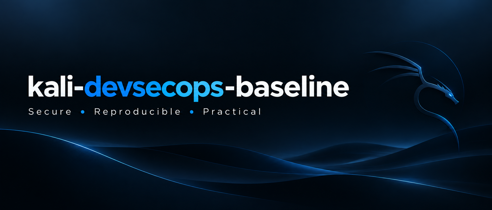

# kali-devsecops-baseline

Operational baseline (minimal, repeatable, and verifiable) for maintaining a Kali Linux host in a secure workstation/client posture, with versioned daily evidence ready for audit and portfolio review.

## Objective

1) Reduce the host attack surface (client mode).
2) Ensure traceability: “execute → record → version → publish”.
3) Produce external evidence (GitHub) with verifiable material.

## Scope

Includes:
- Daily system/network/firewall/disk snapshot in `evidence/YYYY-MM-DD/`
- UFW policy for **client/workstation** mode: `deny incoming`, `allow outgoing`, controlled logging
- Runbooks and scripts for standardized execution

Not currently included:
- Advanced hardening (full CIS, AppArmor tuning, comprehensive auditd ruleset, SELinux, etc.)

## Repository structure

- `configs/` configuration files (UFW, network, templates)
- `scripts/` executable scripts for evidence collection and baseline application
- `runbooks/` operational procedures (auditable step-by-step)
- `evidence/YYYY-MM-DD/` daily evidence (command outputs, status, checks)
- `reports/` summary reports (e.g., weekly/monthly, comparisons)

## Daily operational model (10–15 minutes)

1) Collect evidence:
   - system state (kernel, packages, users)
   - network (interfaces, routes, DNS)
   - firewall (UFW status + logs)
   - storage (df, lsblk)

2) Verify baseline:
   - UFW active and consistent with “client” mode
   - exposed services minimized
   - updates planned (no “blind upgrade” during critical hours)

3) Publish evidence:
   - `git add`
   - `git commit -m "evidence: YYYY-MM-DD baseline snapshot"`
   - `git push`

## UFW (client/workstation mode)

Premise: this host is NOT a server. Therefore:
- inbound: blocked by default
- outbound: allowed by default (with controlled logging)

Expected state example:
- `Default: deny (incoming), allow (outgoing)`
- `ufw status verbose` with no unnecessary open ports

Note: ICMP (ping) is not “proto icmp” in UFW. UFW is a front end for iptables/nftables; ICMP is typically handled in “before/after” rules. This repository will have a specific runbook for this when necessary.

## Evidence and auditability

Each execution should generate verifiable artifacts:
- output files in `evidence/YYYY-MM-DD/`
- optionally signed commit (future improvement)
- clear change trail: what changed, why it changed, and when it changed

## Roadmap (future modules)

- AppArmor baseline by profile
- auditd (minimal rules + export)
- sysctl hardening (curated)
- local scan (lynis) + report
- service/listener verification (ss/lsof) with diffs

